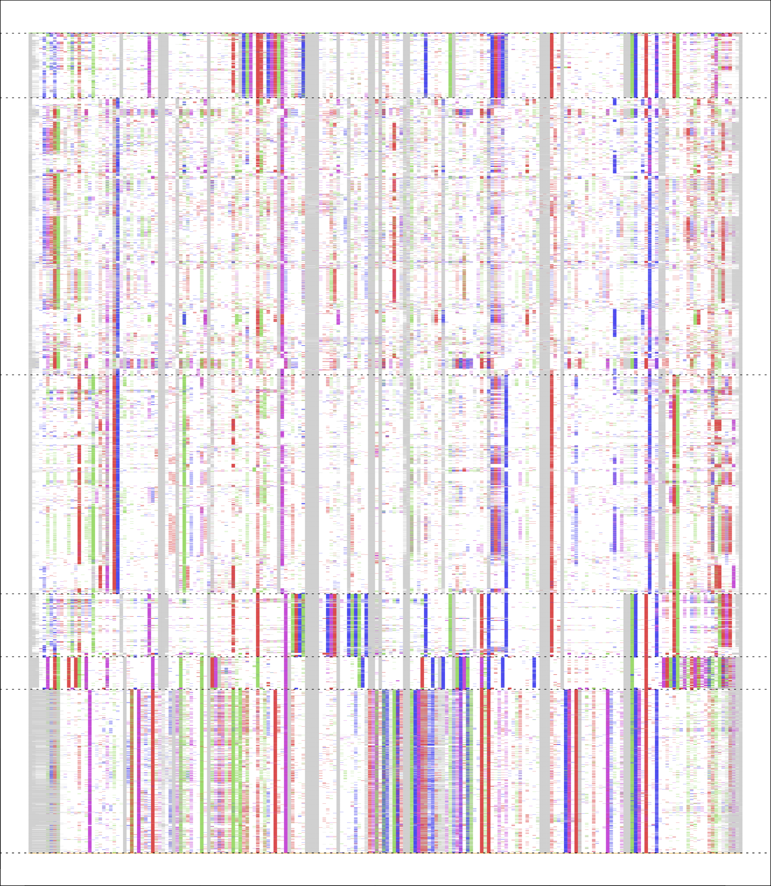
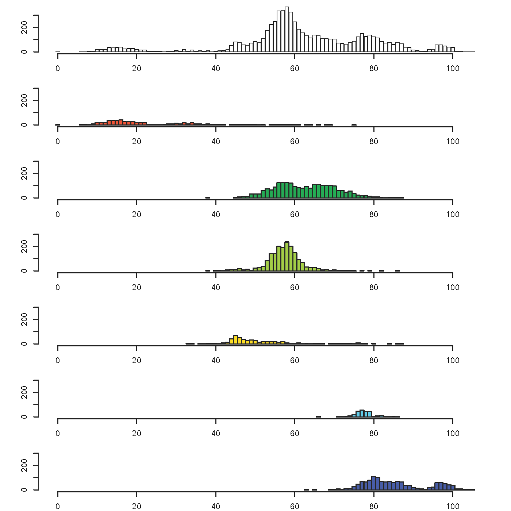
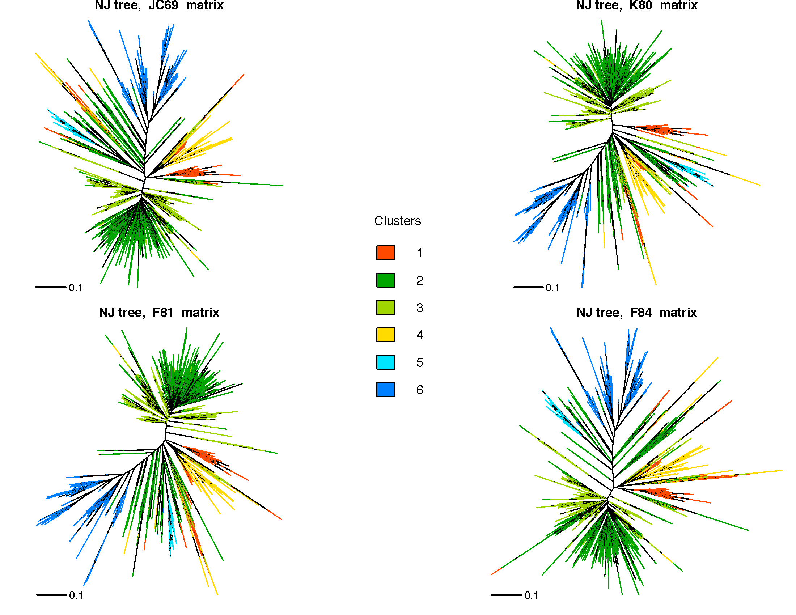

```{r setup,echo=FALSE}
knitr::opts_knit$set(root.dir = '../EXPERIMENTS/8_PB_and_T10')
knitr::opts_chunk$set(fig.path='Figures/')
knitr::opts_chunk$set(warning=FALSE,error=FALSE,message=FALSE)
```
```{r, echo=FALSE}
library(ggplot2)
library(dplyr)
library(plyr)
library(gridExtra)
library(phyclust)
load("./RData/2015-01-21-ClstrOptK2-10-PBandT10.RData")
```

Ran the find.best() method of the R-package Phyclust from K=2 to K=10 on 6 different randomly sampled 500 repeats. The plot of maximum LogL values increases with cluster number but does not have an obvious inflection point suggesting an ideal cluster number.
```{r LogL_by_K, echo=FALSE, fig.height=3, fig.width=5, fig.align='center'}
l <- length(phyclust.clstrs)
df <- data.frame(i=integer(),k=integer(),logL=integer())

for(i in 1:l){
    iter <- phyclust.clstrs[[i]]
    for(j in 1:length(iter)){
        temp <- data.frame(i = i, k = iter[[j]]$K, logL = iter[[j]]$logL)
        df <- dplyr::bind_rows(df,temp)
    } 
}

p <- ggplot(df, aes(x=k,y=logL)) + geom_point(colour="grey60") +stat_smooth()
p <- p + xlab("No. of Clusters") +ylab("Log likelihood")
p <- p + theme_bw()
p <- p + theme(axis.text=element_text(size=8, face="bold"), axis.title=element_text(size=12))
p <- p + scale_x_continuous(breaks=c(2,4,6,8,10))
#p <- p + geom_vline(xintercept=7, colour="red", linetype=2)
p
```


To visualize the clustering history I generated clustergrams for four of the runs. A clustergram is a plot where each line represents the clustering history of a single data point.
```{r ClustergramK2-K10, echo=FALSE, fig.height=6,fig.width=7}
plot.clustergram <- function(clusters){
    i_pos <- !duplicated(clusters$i)
    means <- plyr::ddply(clusters,.(cluster,i),summarise,min=min(height),max=max(height))
    clusters$cluster <- as.factor(clusters$cluster)
    ggplot(clusters, aes(i)) +
        geom_line(aes(y = height, group = obs, colour = height)) +
        scale_colour_gradientn(colours=topo.colors(10)) +
        geom_errorbar(data = means,aes(ymin = min, ymax = max),width = 0.1) +
        scale_x_continuous("Clusters", breaks = clusters$i[i_pos], labels = clusters$k[i_pos]) +
        theme_bw() + 
        theme(axis.text.y=element_blank(), axis.ticks.y=element_blank(), axis.title.y=element_blank()) +
        guides(colour=FALSE)
}

a <- plot.clustergram(cg.list[[1]])
b <- plot.clustergram(cg.list[[2]])
c <- plot.clustergram(cg.list[[3]])
d <- plot.clustergram(cg.list[[4]])

library(gridExtra)
grid.arrange(a,b,c,d,ncol=2,nrow=2)
```

The clustergram indicates that after K=6 or 7 there is a greater shuffling of sequences between clusters and the increase in cluster number is effectively achieved by shaving off of the bottom most cluster.

I choose to cluster the full dataset of 6868 aligned repeats from both PacBio and TAIR10 at K=6 and K=10. The population structure identified by phyclust() can be strongly affected by the choice of initialization options:
```{r, echo=FALSE}
.show.option()
```

The function find.best() is useful for finding the highest
likelihood fit among multiple calls to phyclust() with varying arguments. I choose to try `r .init.procedure[-1]` algorithms with the following two initialization methods: `r .init.method[1]` and `r .init.method[5]` for K=6 and K=7 on the full dataset.

Within a K value the algorithm converged to the same solution.
```{r, echo=FALSE}
load("./RData/findbest6_Kmedoids.RData")
load("./RData/findbest6_randomMu.RData")
load("./RData//findbest6_randomNJ.RData")
load("./RData/findbest7_Kmedoids.RData")
load("./RData/findbest7_randomMu.RData")
phyclst_all <-c(list(findbest6_Kmedoids),list(findbest6_randomMu),list(findbest6_randomNJ),list(findbest7_Kmedoids),list(findbest7_randomMu))

toprint <- function(x){
    temp <-paste("K",":",x$K," ",x$init.method," ","n.class:")
    temp2 <- as.character(x$n.class)
    return(c(temp,paste(temp2,collapse=" ")))
}
lapply(phyclst_all,toprint)
```

The clustergrams of the following clustering solutions are informative and suggest that K=6 is a better solution that K=7(?)
```{r Clustergram_K6K7, echo=FALSE}
#Generate the the dataframes that are inputs for the clustergram function
Kmed6 <- data.frame(obs = seq_len(findbest6_Kmedoids$N.X.org), i = 1, k = 6, cluster = findbest6_Kmedoids$class.id)
KrndMu6 <- data.frame(obs = seq_len(findbest6_randomMu$N.X.org), i = 2, k = 6, cluster = findbest6_randomMu$class.id)
KrndNJ6 <- data.frame(obs = seq_len(findbest6_randomNJ$N.X.org), i = 3, k = 6, cluster = findbest6_randomNJ$class.id)
Kmed7 <- data.frame(obs = seq_len(findbest7_Kmedoids$N.X.org), i = 4, k = 7, cluster = findbest7_Kmedoids$class.id)
KrndMu7 <- data.frame(obs = seq_len(findbest7_randomMu$N.X.org), i = 5, k = 7, cluster = findbest7_randomMu$class.id)
cg.df <- dplyr::bind_rows(Kmed6,KrndMu6,KrndNJ6,Kmed7,KrndMu7)

#Source the clustergram function
source("./Scripts/my_clustergram.R")
cgram <-clustergram(cg.df)
lab <- c("K=6,K-medoids","K=6,randomMu","K=6,randomNJ","K=7,K-medoids","K=7,randomMu")

plot.clustergram <- function(clusters){
    i_pos <- !duplicated(clusters$i)
    means <- plyr::ddply(clusters,.(cluster,i),summarise,min=min(height),max=max(height))
    clusters$cluster <- as.factor(clusters$cluster)
    ggplot(clusters, aes(i)) +
        geom_line(aes(y = height, group = obs, colour = height)) +
        scale_colour_gradientn(colours=rev(topo.colors(10))) +
        geom_errorbar(data = means,aes(ymin = min, ymax = max),width = 0.1) +
        scale_x_continuous("", breaks = clusters$i[i_pos], labels = lab) +
        theme_bw() + 
        theme(axis.text.y=element_blank(), axis.ticks.y=element_blank(), axis.title.y=element_blank()) +
        guides(colour=FALSE)
}

plot.clustergram(cgram)
````

I decided to move forward with the K=6 result from the `r .init.method[5]` initialization. Below is the output from a call to plotdots() where each row represents a sequence and each column represents a site.
```{r, echo=FALSE,eval=FALSE}
seqdata <- read.fasta("q_CEN2_All.aln2")
plotdots(seqdata$org, findbest6_Kmedoids$class.id, main="")
````


Below is the output from a call to plothist() which displays the number of mutations of all sequences within each cluster relative to the chosen reference sequence. The top plot is for the whole dataset.
```{r, echo=FALSE, eval=FALSE}
custom <-c(heat.colors(10)[3],terrain.colors(10)[c(1,4)],heat.colors(10)[7],topo.colors(10)[c(4,3)])
.Color <- custom
plothist(seqdata$org,findbest6_Kmedoids$class.id)
```


Summary diversity stats of the six clusters
```{r, echo=FALSE, eval=FALSE}
source("./Scripts/DivCalculator.R")
load("./RData/findbest6_Kmedoids.RData")
seqdata <- read.fasta("q_CEN2_All.aln2")
K6pi <- NucleotideDiv(findbest6_Kmedoids,seqdata$org)
K6hap <-HaplotypeDiv(findbest6_Kmedoids,seqdata$org)
div.df <-cbind(findbest6_Kmedoids$n.class,K6hap,K6pi)
div.df <- as.data.frame(div.df)
colnames(div.df) <-c("No. of Seqs","No. of Haplotypes","Nucleotide diversity,pi")
rownames(div.df) <-c("Cluster1","Cluster2","Cluster3","Cluster4","Cluster5","Cluster6")
save(div.df,file="./RData/div.df.RData")
```
```{r, echo=FALSE}
load("./RData/div.df.RData")
knitr::kable(div.df)
```

Below are phylogenetic relationships between all 6868 repeats analysed using the neighbor-joining method and different distance matrices. Edge colors represent cluster assignment.
```{r K6_NJtrees, echo=FALSE, eval=FALSE}
###This part was run on the server
library(ape)
library(parallel)
msa <- read.dna("q_CEN2_All.aln2","fasta")
mod <- list("JC69","K80","F81","F84")
nj_trees <- mclapply(mod,function(m) nj(dist.dna(msa,pairwise.deletion=TRUE,model=m)),mc.cores=4)
save(mod,nj_trees,file="./RData/q_CEN2_All_NJtrees.RData")
###

load("./RData/findbest6_Kmedoids.RData")
load("./RData/q_CEN2_All_NJtrees.RData")
library(phyclust)

tree.plotter <- function(i){
    par(mar=c(1,0,1,0))
        plotnj(nj_trees[[i]],type="u",findbest6_Kmedoids$class.id,main=paste("NJ tree, ",mod[i]," matrix", collapse=""),rotate.tree=180)
        add.scale.bar(length=0.1,lcol="black",lwd=2)
}

dev.off()
custom <-c(heat.colors(10)[3],terrain.colors(10)[c(1,4)],heat.colors(10)[7],topo.colors(10)[c(4,3)])
.Color <- custom
mat <-matrix(c(1,5,2,3,5,4),2,3,byrow=TRUE)
nf <-layout(mat,widths=c(1,0.5,1),heights=c(1,1))

tree.plotter(1)
tree.plotter(2)
tree.plotter(3)
tree.plotter(4)
plot.new()
clstr <- as.factor(unique(findbest6_Kmedoids$class.id))
legend('center',levels(clstr), fill = .Color, bty="n",title="Clusters", cex=1.2)
```


Phylogenetic relationships between the consensus sequenes of the six clusters analyzed by the Neighbor Joining method and JC69 distance matrix
```{r Clstrs_consensus_NJtree, echo=FALSE}
Mu <- findbest6_Kmedoids$Mu
ret <- phyclust.edist(Mu, edist.model = .edist.model[1])
ret.tree <- nj(ret)
custom <-c(heat.colors(10)[3],terrain.colors(10)[c(1,4)],heat.colors(10)[7],topo.colors(10)[c(4,3)])
.Color <- custom
clstr <- as.factor(unique(findbest6_Kmedoids$class.id))
par(mar=c(0,0,0,0))
plotnj(ret.tree,1:6, edge.width=2.5)
add.scale.bar(length=0.1,lcol="black",lwd=1)
legend('topleft',c("1","2","3","4","5","6"), fill = .Color, bty="n",title="Clusters", cex=1.2)
```

